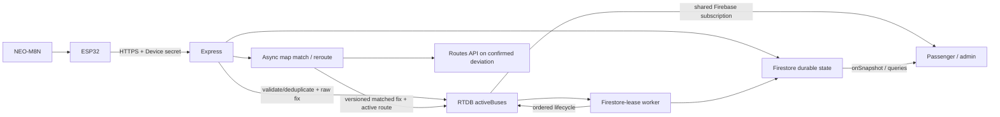

# Architecture and lifecycle summary

Last updated: 2026-10-04 14:20 IST (UTC+05:30).

The authoritative design is split into [High-level design](HIGH_LEVEL_DESIGN.md), [Low-level design](LOW_LEVEL_DESIGN.md), [Firebase data model](../data/FIREBASE_DATA_MODEL.md), and [Hardware telemetry](../hardware/HARDWARE_TELEMETRY.md). This page is the short operational reference.

Hardware pushes; the backend never polls devices. Browsers do not repeatedly poll the live API: Firebase listeners push live changes and REST commands use `fetch`. `fetch` is not an alternative to polling—it is an HTTP API that could be used to implement polling.

Ride state is `pre_departure → in_service → completed`. The driver may arm only their assigned bus/route with a fresh fix. `_active_bus_locks/{busId}` makes the physical bus exclusive across routes. Stop 1 activates service, only the next ordered stop advances, and the final stop completes. GNSS/network loss changes signal/device state, never ride truth.

Device presence and passenger service are separate projections. Fresh authenticated telemetry may make `deviceState: online`, but it does not arm a ride and is visible only as an admin diagnostic. Passenger routes and service counts require `status: active`, a non-empty `sessionId`, a resolved `forward|reverse` direction, and `tripState: pre_departure|in_service`. Direction-pending sessions remain visible to admins as pending and never silently default to forward. Conversely, stale GNSS marks presence offline/unknown without deleting an active service.

RTDB `activeBuses/{busId}_{routeId}` is the current projection. Firestore `active_rides/{busId}_{routeId}` is minimal recovery; `ride_sessions` and `completed_trips` are history. Completion and abandoned cleanup compare session IDs before deleting recovery/lock or changing RTDB, so delayed old work cannot damage a new session.

The live projection keeps authenticated raw GNSS separate from the accepted route match. Matching uses the armed direction's independently routed carriageway, heading and previous along-route progress. An unmatchable fix is never treated as a severe deviation; two ordinary reliable moving deviations or one measured 120 m deviation confirm rerouting. Rerouting continues toward the next required stops while ingestion remains live, and route-cache generation plus version/session/request guards prevent stale route restoration.

Admin route mutation uses `configVersion` for every edit and `geometryVersion` plus an exact route-shaping signature for geometry. A server-only operation lease makes saves idempotent across replicas/restarts; the route and replayable success are committed together after rechecking active rides and the expected version. Metadata-only changes reuse verified directional geometry. Active rides remain immutable: an edit racing with ride creation loses at the final transaction, so live matching, endpoint inference, labels and stop order cannot observe a half-applied route.

Security boundaries: device assignment comes from protected Firestore; device secrets are independent salted scrypt verifiers; browser API calls use Firebase bearer tokens and server role/assignment checks; Firebase is default deny and live writes/internal collections are server-only. Authenticated/unknown network responses are not service-worker cached.

## Runtime budgets and recovery

- Browser live state: one shared RTDB initial snapshot/delta pipeline, with
  route-scoped delivery and local polyline ETA math.
- Firmware capture: one-second evaluation and moving/stopped heartbeat;
  separate one-second connect, 1.5-second HTTP request and ten-second TLS bounds.
- Network recovery: bounded jittered retries and shared device rate-limit
  token leases. No timeout value guarantees total end-to-end latency.
- Device recovery: the 100-sample RTC queue survives warm resets; a compatible
  encrypted flash checkpoint restores one committed fix after full power loss.
  Checkpoints are scheduled every ten seconds, so newer uncommitted fixes can
  be lost. Only the fresh subset is replayed.
- Backend durability: Firestore records lifecycle/stop changes and recovery,
  rather than every coordinate. Map matching holds one in-flight and one
  latest-pending sample per bus.
- Diagnostics: public `/health` exposes readiness; admin `/api/health` reports
  bounded ingestion, rate-limit, queue, dependency and worker evidence.

## Browser access and feedback

- App Check and role verification complete before protected listeners open.
  Failure/timeouts leave readiness closed.
- Account changes/sign-out invalidate pending verification, shared caches and
  old-session feedback requests, including same-account re-verification.
- Both admin feedback views use the latest-200 HTTP list and acknowledged status
  PATCH. Firestore feedback access remains restricted.
- Passenger station/bus selection stays inside the app. Destination selection
  updates the tracking target before boarding and carries into the join form.

See [testing evidence](../testing/README.md) and [deployment checklist](../operations/UNIVERSITY_DEPLOYMENT_CHECKLIST.md)
for physical-route, GNSS, secure-fleet and infrastructure acceptance.
