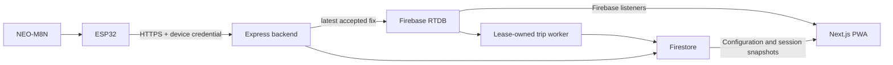

# Eki campus bus tracking

Last updated: 2026-10-04 14:20 IST (UTC+05:30).

Eki lets passengers find a campus bus, choose a destination, join a ride and follow its progress. Administrators manage routes, fleet assignments, ride operations, feedback and history.

An ESP32 with a NEO-M8N GNSS receiver sends authenticated HTTPS telemetry to the Express backend. Firebase Realtime Database (RTDB) delivers live bus state; Firestore stores configuration, ride recovery and history. The Next.js frontend is a static-export progressive web app (PWA).

## Start here

| Your task | Read |
|---|---|
| First-time setup and role workflows | [Getting started](../GETTING_STARTED.md) |
| Environment variables and App Check | [Configuration](../CONFIGURATION.md) |
| Find a technical or operational document | [Documentation index](../index/README.md) |
| Frontend work | [Frontend guide](../frontend/README.md) |
| Backend work | [Backend guide](../backend/README.md) and [API reference](../backend/API.md) |
| Prepare an ESP32 tracker | [Hardware guide](../hardware/README.md) |
| Phone testing, tunnel recovery or a demo | [Local testing](../operations/LOCAL_TESTING.md) and [demo runbook](../operations/LIVE_DEMO_RUNBOOK.md) |
| Contribute a change | [Contributing](CONTRIBUTING.md) |

## Run locally

Use Node.js 24 (the CI version), npm, Git, and a dedicated development Firebase project. Java 21 is needed for rule tests; PlatformIO is needed for firmware work.

Run from the repository root:

```powershell
npm ci
Copy-Item backend/.env.example backend/.env
Copy-Item frontend/env.production.example frontend/.env.local
```

Edit both ignored files before starting:

- Backend: set `NODE_ENV=development`, `PORT=4000`, `CORS_ORIGIN=http://localhost:3000`, the development RTDB URL and Firebase Admin credentials. Keep scheduled retention disabled locally. The tracked backend template uses production mode and port `8080`; copying it unchanged will not start a usable local environment.
- Frontend: set the matching Firebase values, Maps values and `NEXT_PUBLIC_BACKEND_URL=http://localhost:4000`.
- App Check: use a valid provider key or a registered local debug token. Only an unenforced development project may use `NEXT_PUBLIC_FIREBASE_APPCHECK_DISABLED=true` with no provider key. See [configuration](../CONFIGURATION.md#local-app-check-and-auth-setup).

```powershell
npm run dev
```

Open `http://localhost:3000`. Check `http://localhost:4000/health`; HTTP `200` with `{"status":"ok"}` means both Firebase dependency probes are ready. A `503` means the process is running with degraded dependencies.

Follow [getting started](../GETTING_STARTED.md#create-initial-development-data) to create profiles, routes, buses and driver assignments. A phone or ESP32 needs a reachable HTTPS backend origin; its `localhost` points to itself.

## How data moves



- The protected device registry supplies the bus and route assignment. Hardware cannot choose its assignment or write Firebase directly.
- The backend advances only the next ordered stop. The final stop completes a ride; ending it early records `interrupted`.
- A bus lock prevents concurrent rides on one physical bus. Durable ride state supports recovery after network, browser, device or backend interruptions.
- Fresh stopped endpoint evidence can arm the opposite direction after the configured dwell. Device presence alone does not mean passenger service has started.
- Live maps use shared Firebase subscriptions. Admin feedback is a bounded HTTP read; commands and mutations use authenticated HTTP endpoints.

See [architecture](../design/ARCHITECTURE.md), [data model](../data/FIREBASE_DATA_MODEL.md) and [telemetry contract](../hardware/HARDWARE_TELEMETRY.md) for the full behavior.

## Repository map

| Path | Purpose |
|---|---|
| `frontend/` | Passenger/admin UI, authentication, Firebase subscriptions and PWA |
| `backend/` | Device ingestion, authenticated APIs, ride lifecycle and background jobs |
| `hardware/` | ESP32 firmware, configuration templates and host-side policy tests |
| `docs/` | Onboarding, contracts, operations and dated acceptance evidence |
| `e2e/` | Browser regression fixtures and tests |
| `scripts/` | Build, CSP, API verification, documentation sync and trace analysis |
| `observability/` | Optional local Collector/Jaeger stack and dashboard configuration |
| `.github/workflows/` | CI verification and controlled Hosting/rules deployments |
| `firestore.rules`, `database.rules.json` | Firebase client authorization |

## Verify a change

```powershell
npm run verify
```

This runs lint, software tests, build/export, service-worker/CSP generation and the production dependency audit. Run rule, browser and firmware checks separately when affected; [test strategy](../testing/TEST_STRATEGY.md) explains the commands and what each proves.

CI runs on `testing` PRs. Automatic staging deployment is tied to verified pushes to `main`; merging into `testing` does not deploy the application. See [release guide](../operations/CI_CD_AND_RELEASES.md).

## Deployment readiness

The repository supplies application code and repeatable verification. A production release also needs owned infrastructure, approved retention, monitoring/backups, Firebase App Check enforcement, protected firmware provisioning and field acceptance. Use the [deployment checklist](../operations/UNIVERSITY_DEPLOYMENT_CHECKLIST.md) and [current acceptance index](../testing/README.md).

Keep credentials and personal/location evidence in approved private storage. See [security policy](SECURITY.md).

## License

Copyright (c) 2026 Eki Bus Tracking Project. Licensed under the [MIT License](../../LICENSE).
